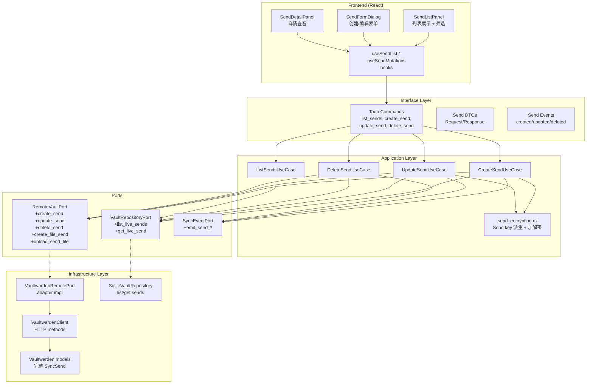
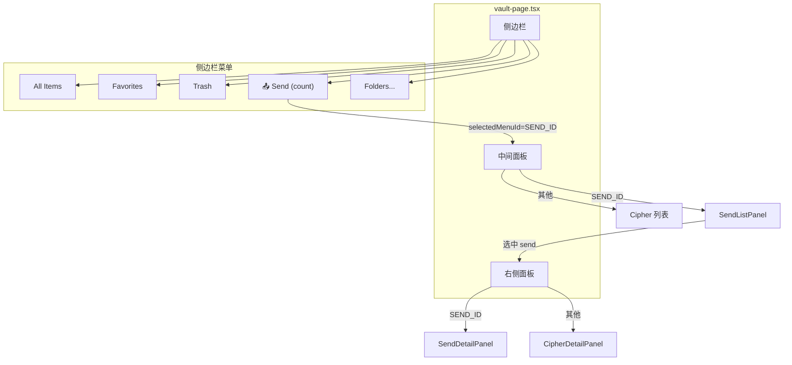

# Send CRUD 实现方案

> 为 Vanguard 实现 Bitwarden Send 的完整增删改查功能，支持 Text 和 File 类型，覆盖后端 Rust 层和前端 React UI。

## 1. Problem Statement

当前 Vanguard 应用对 Send 仅有同步读取能力（全量同步 + WebSocket 增量同步），缺少用户主动的 CRUD 操作（创建、查询列表/详情、更新、删除），且 `SyncSend` 数据模型不完整（仅 6 个字段）。需要扩展为完整的 Send 管理功能，包含 Text 和 File 两种类型，覆盖后端 Rust 层和前端 React UI，且前端设计需与现有 vault 页面保持高度一致的视觉风格和交互模式。

## 2. Requirements

1. 扩展 `SyncSend` 模型为完整字段（access_id, notes, key, password, text, file, max_access_count, access_count, disabled, hide_email, expiration_date, emails, auth_type 等）
2. 支持 Text（type=0）和 File（type=1）两种 Send 类型
3. 实现 CRUD：Create（POST /sends, POST /sends/file/v2）、Read（list + detail）、Update（PUT /sends/{id}）、Delete（DELETE /sends/{id}）
4. File Send 需要两步上传流程：先 POST /sends/file/v2 获取上传 URL，再 POST /sends/{id}/file/{fileId} 上传文件
5. 保持现有全量同步 + WebSocket 增量同步机制正常工作
6. 全栈实现：后端 Tauri commands + 前端 React Send 管理界面
7. 前端 UI 与现有 vault 页面风格一致

## 3. Background

### 3.1 现有 Send 基础设施

| 层级 | 已有内容 |
|------|---------|
| DTO | `SyncSend`（id, type, name, revision_date, deletion_date, object）— 仅 6 字段 |
| 数据库 | `live_sends` / `staging_sends` 表（JSON payload 存储） |
| VaultRepositoryPort | `upsert_sends`, `upsert_send_live`, `delete_send_live`, `count_live_sends` |
| RemoteVaultPort | `get_send`（单条查询） |
| VaultwardenClient | `get_send` 方法 + `send` endpoint |
| 增量同步 | 处理 `SyncSendCreate`, `SyncSendUpdate`, `SyncSendDelete` push events |

### 3.2 Vaultwarden Send API Endpoints

| 方法 | 路径 | 用途 |
|------|------|------|
| POST | `/api/sends` | 创建 Text Send |
| POST | `/api/sends/file/v2` | 创建 File Send（返回 upload URL + fileId） |
| POST | `/api/sends/{id}/file/{fileId}` | 上传文件内容 |
| PUT | `/api/sends/{id}` | 更新 Send |
| DELETE | `/api/sends/{id}` | 删除 Send |
| GET | `/api/sends/{id}` | 获取单个 Send（已实现） |
| GET | `/api/sends` | 获取所有 Sends |

### 3.3 Send 完整数据模型（来自 Bitwarden SDK）

```rust
// 核心字段
id: Option<String>,
access_id: Option<String>,
name: EncString,              // 用 send key 加密
notes: Option<EncString>,     // 用 send key 加密
key: EncString,               // 用 user key 加密的 send key
password: Option<String>,     // PBKDF2(password, send_key, 100000) → base64

// 类型
type: SendType,               // 0=Text, 1=File
text: Option<SendText>,       // { text: Option<EncString>, hidden: bool }
file: Option<SendFile>,       // { id, file_name: EncString, size, size_name }

// 访问控制
max_access_count: Option<u32>,
access_count: u32,
disabled: bool,
hide_email: bool,

// 时间
revision_date: DateTime,
deletion_date: DateTime,
expiration_date: Option<DateTime>,

// 认证
emails: Option<String>,       // 逗号分隔的邮箱列表
auth_type: AuthType,          // 0=Email, 1=Password, 2=None
```

### 3.4 Send 加密机制

```
1. 生成 16 字节随机 send_key
2. 用 HKDF 从 send_key 派生 shareable_key（info="send", salt="send"）
3. 用 shareable_key 加密 name, notes, text.text, file.file_name
4. 用 user_key 加密 send_key → 存储为 key 字段
5. Password: PBKDF2(password_bytes, send_key, 100000) → base64
```

### 3.5 现有前端架构

- 目录结构：feature-based（`src/features/vault/`）
- 技术栈：React + TypeScript + shadcn/ui + TanStack Router/Query + i18next
- Vault 页面布局：三栏 `ResizablePanelGroup`（侧边栏 20% | 列表 40% | 详情 40%）
- 交互模式：侧边栏菜单选择 → 中间列表筛选/搜索 → 右侧详情面板
- 组件模式：Dialog 用于创建/编辑表单，AlertDialog 用于删除确认
- 状态管理：`useVaultPageModel` 聚合 hook + `useCipherMutations` mutation hook + `useCipherEvents` 事件监听 hook
- 样式体系：Tailwind CSS，蓝色主题（blue-50/600/700），slate 灰色系，rounded-lg/xl，shadow-sm/lg

## 4. Proposed Solution

### 4.1 架构总览



### 4.2 前端页面详细设计

#### 4.2.1 集成策略

Send 管理不创建独立路由页面，而是作为 vault 页面侧边栏的一个新菜单项（与 All Items / Favorites / Trash 同级），点击后中间列表和右侧详情面板切换为 Send 视图。



#### 4.2.2 侧边栏菜单

在 Trash 按钮下方、Folders 标题上方新增 Send 菜单项：

```
┌─────────────────────────┐
│ 📦 All Items        (42)│  ← 现有
│ ⭐ Favorites         (5)│  ← 现有
│ 🗑️ Trash             (3)│  ← 现有
│ 📤 Send              (8)│  ← 新增
│                         │
│ ── FOLDERS ── [+ Create]│  ← 现有
│ 📁 Personal         (12)│
│ 📁 Work             (20)│
│ 📁 No Folder         (7)│
└─────────────────────────┘
```

- 图标：`lucide-react` 的 `Send` 图标
- 选中样式：`bg-blue-50 text-blue-700 shadow-sm`（与其他菜单项一致）
- 计数：显示 live_sends 总数
- 常量：`SEND_ID = "__send__"`

#### 4.2.3 Send 列表面板（中间面板）

```
┌──────────────────────────────────┐
│ [All types ▾]  [🔍]        [＋] │  ← 工具栏
├──────────────────────────────────┤
│ ┌──────────────────────────────┐ │
│ │ 📄 My Text Note             │ │  ← SendRow
│ │    Expires: 2024-03-15      │ │
│ └──────────────────────────────┘ │
│ ┌──────────────────────────────┐ │
│ │ 📎 Project Files   [DISABLED]│ │  ← 带状态 Badge
│ │    3/10 views · Exp: 3/20   │ │
│ └──────────────────────────────┘ │
│ ┌──────────────────────────────┐ │
│ │ 📄 API Credentials          │ │
│ │    No expiration             │ │
│ └──────────────────────────────┘ │
│                                  │
│         (更多列表项...)           │
└──────────────────────────────────┘
```

**工具栏：**
- 左侧：类型筛选下拉（All types / Text / File），样式与 cipher 类型筛选一致
- 中间：内联搜索（点击搜索图标展开，与 cipher 搜索交互一致）
- 右侧：新建按钮（`Plus` 图标）

**SendRow 组件：**
- 左侧图标：Text → `FileText`，File → `Paperclip`（9x9 圆角方块，与 CipherIcon 一致）
- 名称：`text-sm font-semibold`
- 副标题：过期时间 / 访问次数（`text-xs text-slate-500`）
- 状态 Badge：`disabled` → 灰色，`expired` → 红色（使用 shadcn Badge 组件）
- 选中样式：`bg-blue-50 border-blue-200 text-blue-900 shadow-sm`
- 右键菜单（ContextMenu）：编辑、复制链接、删除

**空状态：**
```
┌──────────────────────────────────┐
│                                  │
│           📤                     │
│     No sends yet                 │
│  Create a send to share          │
│  text or files securely          │
│                                  │
│      [+ Create Send]             │
│                                  │
└──────────────────────────────────┘
```

#### 4.2.4 Send 详情面板（右侧面板）

```
┌──────────────────────────────────┐
│ My Text Note          [✏️] [🗑️] │  ← 标题 + 操作按钮
│ [Text]                           │  ← 类型 Badge
├──────────────────────────────────┤
│                                  │
│ TEXT CONTENT                     │  ← 区域标题
│ ┌──────────────────────────────┐ │
│ │ This is the shared text...   │ │
│ │ (click to reveal if hidden)  │ │
│ └──────────────────────────────┘ │
│                                  │
│ NOTES                            │
│ Some private notes here          │
│                                  │
│ SEND LINK                        │
│ ┌──────────────────────────────┐ │
│ │ https://vault.example.com/.. │ │
│ │                        [📋] │ │  ← 复制按钮
│ └──────────────────────────────┘ │
│                                  │
│ DETAILS                          │
│ Password       ● Protected      │
│ Max views      10                │
│ Current views  3                 │
│ Hide email     Yes               │
│ Disabled       No                │
│                                  │
│ DATES                            │
│ Expiration     2024-03-15 12:00  │
│ Deletion       2024-03-22 12:00  │
│ Last updated   2024-03-08 09:30  │
│                                  │
└──────────────────────────────────┘
```

- 标题区域：Send 名称（`text-lg font-bold`）+ 类型 Badge + 编辑/删除按钮
- 字段展示：使用与 CipherDetailPanel 一致的 label + value 行样式
- Text 内容：hidden 时默认显示 `••••••••`，点击/hover 显示真实内容
- File 信息：文件名 + 文件大小
- Send 链接：带复制按钮的链接展示区域
- 未选中状态：居中提示 "Select a send to view details"

#### 4.2.5 Send 创建/编辑表单（Dialog）

```
┌──────────────────────────────────────┐
│ Create Send                      [✕] │
│ Create a new send to share securely  │
├──────────────────────────────────────┤
│                                      │
│ Type                                 │
│ [Text           ▾]                   │
│                                      │
│ Name *                               │
│ [________________________]           │
│                                      │
│ ── Text Content ──                   │  ← type=Text 时显示
│ [                        ]           │
│ [                        ]           │
│ [________________________]           │
│ □ Hide text by default               │
│                                      │
│ ── File ──                           │  ← type=File 时显示
│ [Choose file...        ] 📎          │
│                                      │
│ Notes                                │
│ [________________________]           │
│                                      │
│ ▸ Advanced Options                   │  ← Collapsible
│ ┌──────────────────────────────────┐ │
│ │ Password                         │ │
│ │ [________________________]       │ │
│ │                                  │ │
│ │ Max access count                 │ │
│ │ [________________________]       │ │
│ │                                  │ │
│ │ Expiration date                  │ │
│ │ [________________________]       │ │
│ │                                  │ │
│ │ Deletion date *                  │ │
│ │ [____2024-03-22T12:00___]        │ │
│ │                                  │ │
│ │ □ Hide my email                  │ │
│ │ □ Disable this send              │ │
│ └──────────────────────────────────┘ │
│                                      │
├──────────────────────────────────────┤
│              [Cancel]  [Create Send] │
└──────────────────────────────────────┘
```

- 表单库：`@tanstack/react-form`（与 CipherFormDialog 一致）
- 类型选择：创建时可选 Text/File，编辑时只读
- 必填字段：名称、删除时间（默认 7 天后）
- 高级选项：使用 shadcn Collapsible 组件折叠
- 文件选择：使用原生 `input[type=file]`，显示已选文件名和大小
- 底部按钮：与 CipherFormDialog 一致的样式

#### 4.2.6 删除确认对话框

完全参考 `DeleteCipherDialog` 的样式和交互：

```
┌──────────────────────────────────┐
│ ⚠️ Delete Send                   │
│                                  │
│ Are you sure you want to delete  │
│ "My Text Note"? This action      │
│ cannot be undone.                │
│                                  │
│           [Cancel]  [Delete]     │
└──────────────────────────────────┘
```

#### 4.2.7 前端目录结构

```
src/features/send/
├── hooks/
│   ├── use-send-list.ts          # 调用 list_sends，管理列表状态和筛选
│   ├── use-send-mutations.ts     # create/update/delete mutations
│   ├── use-send-events.ts        # 监听 SendCreated/Updated/Deleted 事件
│   └── index.ts
├── components/
│   ├── send-list-panel.tsx       # 列表面板（替换中间 cipher 列表）
│   ├── send-row.tsx              # 列表项
│   ├── send-detail-panel.tsx     # 详情面板（替换右侧 cipher 详情）
│   ├── send-form-dialog.tsx      # 创建/编辑表单 Dialog
│   ├── delete-send-dialog.tsx    # 删除确认 Dialog
│   └── index.ts
├── types.ts                      # SendTypeFilter 等类型定义
├── constants.ts                  # SEND_ID 等常量
├── utils.ts                      # Send 链接生成、过期状态判断、格式化
└── index.ts
```

#### 4.2.8 与 vault-page.tsx 的集成

在 `vault-page.tsx` 中通过条件渲染切换，不修改现有 cipher 逻辑：

```tsx
// 侧边栏：在 Trash 按钮下方新增
<button onClick={() => setSelectedMenuId(SEND_ID)} ...>
  <Send className="size-4" />
  {t("vault.page.menus.send")}
  <span>{sendCount}</span>
</button>

// 中间面板：条件渲染
{selectedMenuId === SEND_ID ? (
  <SendListPanel
    onSelectSend={setSelectedSendId}
    onCreateSend={handleCreateSend}
    selectedSendId={selectedSendId}
  />
) : (
  /* 现有 cipher 列表 */
)}

// 右侧面板：条件渲染
{selectedMenuId === SEND_ID ? (
  <SendDetailPanel
    sendId={selectedSendId}
    onEdit={handleEditSend}
    onDelete={handleDeleteSend}
  />
) : (
  <CipherDetailPanel ... />
)}
```

Send 相关的 Dialog 状态和处理函数在 vault-page.tsx 中管理（与 cipher/folder 的模式一致）。

## 5. Task Breakdown

### Task 1: 扩展 SyncSend 数据模型为完整字段

**目标：** 将 `SyncSend` 从 6 个字段扩展为完整的 Bitwarden Send 模型。

**实现指导：**
- 扩展 `application/dto/sync.rs` 中的 `SyncSend`，添加：`access_id`, `notes`, `key`, `password`, `text`(SyncSendText), `file`(SyncSendFile), `max_access_count`, `access_count`, `disabled`, `hide_email`, `expiration_date`, `emails`, `auth_type`
- 新增 `SyncSendText`（text, hidden）和 `SyncSendFile`（id, file_name, size, size_name）子结构
- 扩展 `infrastructure/vaultwarden/models.rs` 中的远程 `SyncSend` 模型对应字段
- 更新 `infrastructure/vaultwarden/mapper.rs` 中的 `map_sync_send` 映射函数
- 新增 `SendRequestModel`（用于 create/update 请求的序列化模型）到 vaultwarden models

**测试：** `cargo test && cargo clippy` 通过，现有同步功能不受影响

**Demo：** 扩展后的模型能正确序列化/反序列化，全量同步仍正常工作

---

### Task 2: 扩展 VaultRepositoryPort — Send 的 list 和 get

**目标：** 为 Send 添加本地查询能力。

**实现指导：**
- 在 `VaultRepositoryPort` 添加 `list_live_sends(&self, account_id: &str) -> AppResult<Vec<SyncSend>>` 和 `get_live_send(&self, account_id: &str, send_id: &str) -> AppResult<Option<SyncSend>>`
- 在 `SqliteVaultRepository` 实现（参考 `list_live_ciphers` / `get_live_cipher` 的模式）

**测试：** `cargo test` 通过

**Demo：** 可以从本地数据库查询已同步的 Send 列表和详情

---

### Task 3: 扩展 RemoteVaultPort 和 VaultwardenClient — Send 远程 CRUD API

**目标：** 添加 Send 的远程创建、更新、删除 API 调用能力。

**实现指导：**
- 在 `VaultwardenEndpoints` 添加 `sends`（POST /api/sends）、`sends_file_v2`（POST /api/sends/file/v2）、`send_file_upload`（POST /api/sends/{id}/file/{fileId}）
- 在 `VaultwardenClient` 添加 `create_send`、`create_file_send`、`upload_send_file`、`update_send`、`delete_send` 方法
- 在 `RemoteVaultPort` trait 添加对应方法
- 在 `VaultwardenRemotePort` 实现
- 在 `application/dto/sync.rs` 添加 `CreateSendCommand`、`UpdateSendCommand`、`DeleteSendCommand`、`SendMutationResult`、`CreateFileSendResult`

**测试：** `cargo test && cargo clippy` 通过

**Demo：** 远程 API 调用层完整可用

---

### Task 4: 实现 Send 加密模块

**目标：** 实现 Send 特有的加密/解密逻辑。

**实现指导：**
- 新建 `application/send_encryption.rs`（参考 `cipher_encryption.rs` 的模式）
- 实现 Send key 生成（16 字节随机 → HKDF 派生）、Send key 加密（用 user key 加密 send key）
- 实现 `encrypt_send`：加密 name, notes, text.text, file.file_name 字段
- 实现 `decrypt_send`：解密上述字段（用于本地展示）
- Password 处理：PBKDF2(password, send_key, 100000) → base64

**测试：** 单元测试验证加解密往返一致性

**Demo：** Send 数据可以正确加密后发送到服务器，从服务器获取后可以正确解密

---

### Task 5: 实现 Send CRUD Use Cases + Events

**目标：** 创建 CreateSendUseCase、UpdateSendUseCase、DeleteSendUseCase、ListSendsUseCase。

**实现指导：**
- `CreateSendUseCase`：验证 → 加密 → 调用 remote_vault.create_send（Text）或 create_file_send + upload_send_file（File）→ 本地 upsert → emit event
- `UpdateSendUseCase`：验证 → 加密 → remote_vault.update_send → 本地 upsert → emit event
- `DeleteSendUseCase`：验证 → remote_vault.delete_send → 本地 delete → emit event
- `ListSendsUseCase`：从 vault_repository 读取 → 解密 → 返回
- 在 `SyncEventPort` 添加 `emit_send_created`、`emit_send_updated`、`emit_send_deleted`
- 在 `TauriSyncEventAdapter` 实现这些事件
- 注册新的 Tauri events：`SendCreated`、`SendUpdated`、`SendDeleted`

**测试：** `cargo test` 通过

**Demo：** Use cases 完整可调用

---

### Task 6: Tauri Commands + AppState 布线

**目标：** 将 Send CRUD 暴露为 Tauri commands，完成 DI 布线。

**实现指导：**
- 新建 `interfaces/tauri/commands/send.rs`，实现 `list_sends`、`create_send`、`update_send`、`delete_send` commands
- 新建 `interfaces/tauri/dto/send.rs`，定义请求/响应 DTOs（`CreateSendRequestDto`、`UpdateSendRequestDto`、`SendItemDto`、`SendDetailDto` 等）
- 在 `AppState` 添加 send use cases 字段和 getter
- 在 `wiring.rs` 构建并注入 send use cases
- 在 `lib.rs` 注册新的 commands 和 events
- 更新 `mod.rs` 文件

**测试：** `cargo build` 成功，`cargo clippy` 通过，bindings.ts 自动生成

**Demo：** 前端可以通过 Tauri invoke 调用 Send CRUD 操作

---

### Task 7: 前端 Send feature 基础结构 + 列表集成

**目标：** 创建 Send feature 目录结构，实现列表展示，集成到 vault 侧边栏。

**实现指导：**
- 创建 `src/features/send/` 目录结构（hooks/, components/, types.ts, constants.ts, utils.ts, index.ts）
- `constants.ts`：`SEND_ID = "__send__"`
- `types.ts`：`SendTypeFilter = "all" | "text" | "file"`
- `hooks/use-send-list.ts`：调用 `commands.listSends()`，管理列表状态和筛选
- `hooks/use-send-events.ts`：监听 `SendCreated/Updated/Deleted` 事件，触发列表刷新
- `components/send-row.tsx`：列表项组件，左侧 FileText/Paperclip 图标 + 名称 + 副标题（过期时间/访问次数/状态 Badge），选中样式 `bg-blue-50 border-blue-200`
- `components/send-list-panel.tsx`：顶部工具栏（类型筛选 + 搜索 + 新建按钮）+ ScrollArea 列表 + 空状态
- 在 vault-page.tsx 侧边栏 Trash 下方添加 Send 菜单按钮（`Send` 图标 + count）
- 在 vault-page.tsx 中间面板条件渲染：`selectedMenuId === SEND_ID ? <SendListPanel /> : 现有列表`
- 添加 i18n 翻译键（en.ts / zh.ts）：`vault.page.menus.send`、`send.list.*`、`send.types.*`

**测试：** `pnpm build` 通过

**Demo：** 用户可以在侧边栏点击 Send，看到已同步的 Send 列表，支持类型筛选和搜索

---

### Task 8: 前端 Send 详情面板

**目标：** 实现 Send 详情展示。

**实现指导：**
- `components/send-detail-panel.tsx`：
  - 顶部：Send 名称 + 类型 Badge（Text/File）+ 编辑/删除按钮
  - 信息区域（使用与 CipherDetailPanel 一致的字段展示样式 — label + value 行）：
    - Text Send：文本内容（hidden 时默认遮罩，点击显示）
    - File Send：文件名 + 文件大小
    - 备注
    - 安全设置：密码保护（有/无）、最大访问次数、当前访问次数
    - 时间：过期时间、删除时间
    - 状态：隐藏邮箱、禁用
  - Send 链接区域：链接文本 + 复制按钮
  - 未选中状态：居中提示
- 在 vault-page.tsx 右侧面板条件渲染：`selectedMenuId === SEND_ID ? <SendDetailPanel /> : <CipherDetailPanel />`
- 添加 i18n 翻译键：`send.detail.*`

**测试：** `pnpm build` 通过

**Demo：** 用户选中 Send 后可以在右侧看到完整详情

---

### Task 9: 前端 Send 创建/编辑表单

**目标：** 实现 Send 创建和编辑的表单 UI。

**实现指导：**
- `hooks/use-send-mutations.ts`：create/update/delete mutations（参考 `use-cipher-mutations.ts`）
- `components/send-form-dialog.tsx`（Dialog，参考 `cipher-form-dialog.tsx`）：
  - 使用 `@tanstack/react-form`
  - 类型选择（Select：Text / File）— 创建时可选，编辑时只读
  - 名称（TextInput，必填）
  - Text 专属：文本内容（Textarea）+ 隐藏文本（Switch）
  - File 专属：文件选择（input[type=file]）+ 已上传文件信息展示
  - 备注（Textarea）
  - 高级选项（Collapsible）：密码、最大访问次数、过期时间、删除时间（默认 7 天后）、隐藏邮箱、禁用
  - 底部：取消 + 确认按钮
- 在 vault-page.tsx 添加 Send 表单状态管理和处理函数（与 cipher form 模式一致）
- 添加 i18n 翻译键：`send.form.*`

**测试：** `pnpm build` 通过

**Demo：** 用户可以通过 UI 创建 Text/File Send，编辑已有 Send

---

### Task 10: 前端 Send 删除 + 完整集成 + Pre-commit

**目标：** 实现删除功能，完成全栈集成。

**实现指导：**
- `components/delete-send-dialog.tsx`（参考 `delete-cipher-dialog.tsx`）
- 列表项右键菜单（ContextMenu）：编辑、复制链接、删除
- `utils.ts`：Send 链接生成（`{base_url}/#/send/{access_id}/{key}`）、过期状态判断、格式化
- 确保 WebSocket 增量同步与手动 CRUD 协调一致
- 完整 i18n 翻译补全
- 运行 pre-commit checks：`cargo test && cargo clippy && cargo fmt && pnpm run biome:write && pnpm run biome:format && pnpm build`

**测试：** 全栈 pre-commit checks 通过

**Demo：** 完整的 Send 管理功能可用 — 创建、列表、详情、编辑、删除、复制链接，Text + File 类型，与 vault 页面无缝集成
